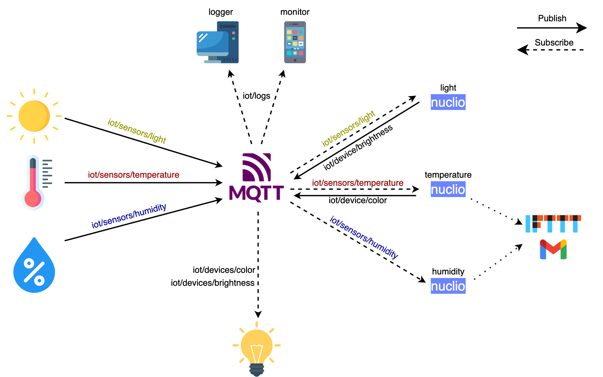

# SmartEnvironment

AbstractAbstractAbstractAbstractAbstractAbstractAbstractAbstractAbstractAbstractAbstractAbstractAbstractAbstractAbstractAbstractAbstractAbstractAbstractAbstractAbstractAbstractAbstractAbstractAbstractAbstractAbstractAbstractAbstractAbstractAbstractAbstractAbstractAbstractAbstractAbstractAbstractAbstractAbstractAbstractAbstractAbstractAbstractAbstractAbstractAbstractAbstractAbstractAbstractAbstractAbstractAbstractAbstractAbstractAbstractAbstractAbstractAbstractAbstractAbstractAbstractAbstractAbstractAbstractAbstractAbstractAbstractAbstractAbstractAbstractAbstractAbstractAbstractAbstractAbstractAbstractAbstractAbstractAbstractAbstractAbstractAbstractAbstractAbstractAbstractAbstractAbstractAbstractAbstractAbstractAbstractAbstractAbstractAbstractAbstractAbstractAbstractAbstractAbstractAbstractAbstractAbstractAbstractAbstractAbstractAbstractAbstractAbstractAbstractAbstractAbstractAbstractAbstractAbstractAbstractAbstractAbstractAbstractAbstract

#### Tutorial Structure

* **[Architecture](#architecture)**
* **[Prerequisites](#prerequisites)**
* **[Installation](#installation)**
* **[Examples](#examples)**


## Architecture
<p align="center"></p>

## Prerequisites
- OS: 
    - Ubuntu 18.04 LTS
- Software:
    - Docker and Docker Compose (Application containers engine)
    - Nuclio (Serverless computing provider)
    - RabbitMQ (AMQP and MQTT message broker)
    - Node.js

## Installation

### Docker
Install Docker using the Docker CE installation [guide](https://docs.docker.com/install/linux/docker-ce/ubuntu/#extra-steps-for-aufs).

```sh
$ sudo apt-get update
$ sudo apt-get install \
    apt-transport-https \
    ca-certificates \
    curl \
    gnupg \
    lsb-release
$ curl -fsSL https://download.docker.com/linux/ubuntu/gpg | sudo gpg --dearmor -o /usr/share/keyrings/docker-archive-keyring.gpg
$ echo \
  "deb [arch=amd64 signed-by=/usr/share/keyrings/docker-archive-keyring.gpg] https://download.docker.com/linux/ubuntu \
  $(lsb_release -cs) stable" | sudo tee /etc/apt/sources.list.d/docker.list > /dev/null
$ sudo apt-get update
$ sudo apt-get install docker-ce
```

------------------------------------------------------------------------------------------------------------------------------
### Nuclio 
Start [Nuclio](https://github.com/nuclio/nuclio) using a docker container.

```sh
$ docker run -p 8070:8070 -v /var/run/docker.sock:/var/run/docker.sock -v /tmp:/tmp nuclio/dashboard:stable-amd64
```

----------------------------------------------------------------------------------------------------------------------------

### RabbitMQ 

Start [RabbitMQ](https://www.rabbitmq.com) instance with MQTT enabled using docker.

```sh
$ docker run -p 9000:15672  -p 1883:1883 -p 5672:5672  cyrilix/rabbitmq-mqtt 
```

------------------------------------------------------------------------------------------------------------------------------

### Setup functions
1. Open nuclio Dashboard http://localhost:8070
2. Create a new nuclio project
3. Inside the project click un <b>NEW FUNCTION</b>
4. Import each .yaml file that is in functions directorym one by one


------------------------------------------------------------------------------------------------------------------------------

### JS Libraries

For JavaScript MQTT we used this [library](https://www.npmjs.com/package/mqtt).

### ESP8266 Libraries

For ESP8266 MQTT we used this [library](https://www.arduino.cc/reference/en/libraries/pubsubclient/).<br>
For ESP8266 temperature and humidity sensor we used this [library](https://www.arduino.cc/reference/en/libraries/dht-sensor-library/).<br>
For ESP8266 WI-FI we used this [library](https://arduino-esp8266.readthedocs.io/en/latest/esp8266wifi/readme.html).

### MQTT Clients

We used a general purpose MQTT client for [Android](https://play.google.com/store/apps/details?id=in.dc297.mqttclpro) or [iOS](https://apps.apple.com/us/app/easymqtt/id1523099606).

-----------------------------------------------------------------------------------------------------------------------------

**Authors**
Lorenzo Fasolino
